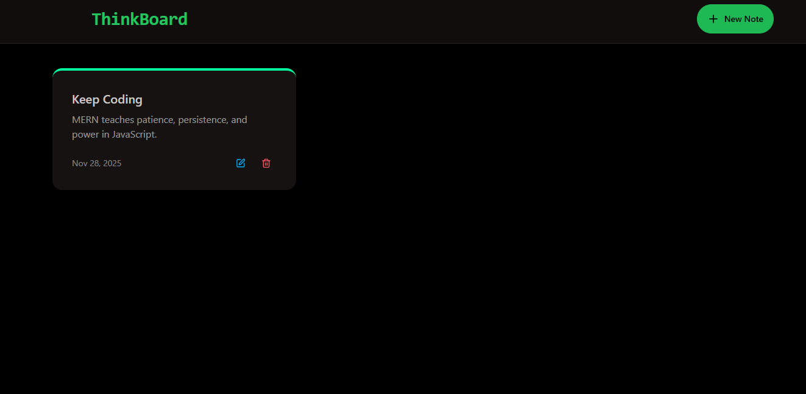
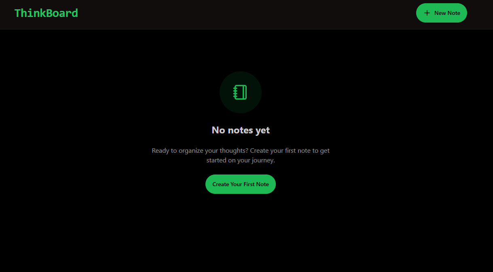

# ⭐ MERN ThinkBoard

A full-stack note-taking application built with the **MERN stack** (MongoDB, Express, React, Node.js).  
This project is based on the FreeCodeCamp MERN tutorial.

---

## 📌 Features
- Create, read, update, and delete notes  
- Responsive and clean React UI  
- RESTful API with Express  
- MongoDB database for persistent storage  
- Axios for frontend–backend communication  
- Organized file structure for both client & server

---

## 🛠 Tech Stack

### Frontend
- React  
- Axios  
- CSS / Tailwind 

### Backend
- Node.js  
- Express.js  
- MongoDB / Mongoose  

---


## 🚀 How to Run the Project

### **Run the Backend**
```bash
cd backend
npm install
npm run dev
```

### **Run the Frontend**
```bash
cd frontend
npm install
npm run dev
```

## 📸 Screenshots

 <br>
<br>


